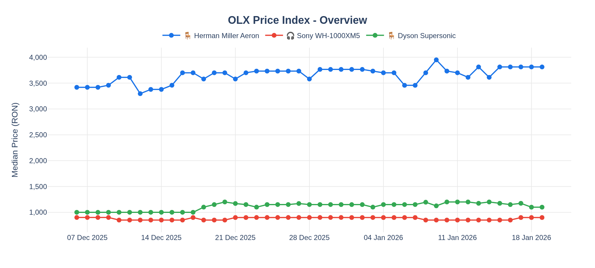
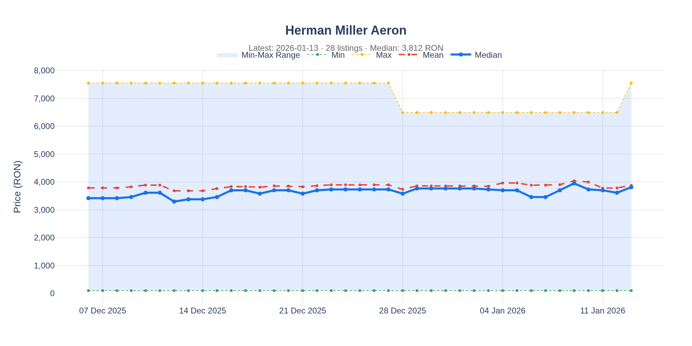
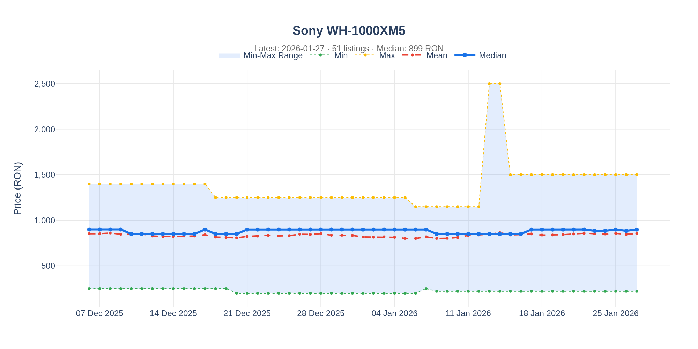
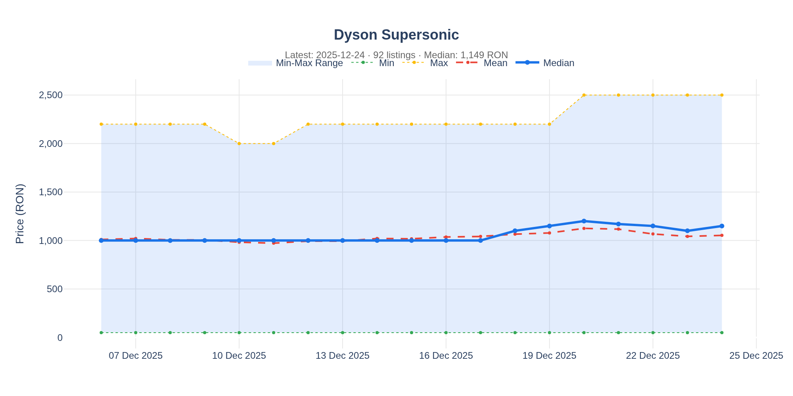

# OLX Price Index

Daily price tracking for products on OLX.ro as a proxy for economic indicators.

---

## 🪑 Herman Miller Aeron

| Metric | Value |
|--------|-------|
| Listings | 34 |
| Min | 100 RON |
| Max | 7,549 RON |
| Median | 3,418 RON |
| Average | 3,788 RON |
| Last Update | 2025-12-06 |

---

## 🎧 Sony WH-1000XM5

| Metric | Value |
|--------|-------|
| Listings | 42 |
| Min | 250 RON |
| Max | 1,400 RON |
| Median | 900 RON |
| Average | 852 RON |
| Last Update | 2025-12-06 |

---

## 🪑 Dyson Supersonic

| Metric | Value |
|--------|-------|
| Listings | 101 |
| Min | 50 RON |
| Max | 2,200 RON |
| Median | 1,000 RON |
| Average | 1,010 RON |
| Last Update | 2025-12-06 |

---

## About

This index tracks prices of various products on OLX.ro to provide insights into market trends.

**Metrics:**
- **Count**: Number of active listings
- **Min/Max**: Price range
- **Median**: Middle price (robust to outliers)
- **Average**: Mean price

Data is collected daily via GitHub Actions.

---

*Generated automatically by [Aeron Miller Index](https://github.com/FlorinPopaCodes/aeron-miller-index)*